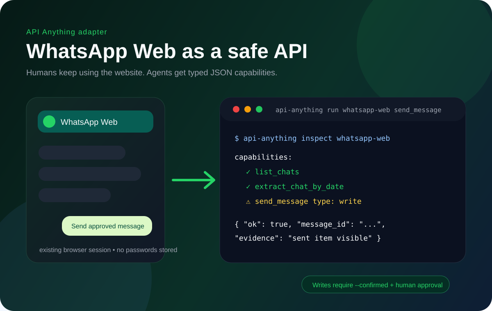

# API Anything

> **Turn any website into an agent-ready API harness — without taking the human out of the loop.**

API Anything is a local-first runtime for wrapping websites, dashboards, docs, and browser-authenticated apps as typed capabilities that **AI agents can inspect and run** and **humans can understand and approve**.



```text
Website / Web app  ──►  API Anything Harness  ──►  Agent / CLI / MCP / Workflow
Human UI               manifest + adapter          typed JSON capability
```

## Why this exists

Humans use websites. Agents need APIs.

A lot of real work still happens inside messy web apps: WhatsApp Web, admin panels, CRMs, docs, inboxes, social tools, dashboards, and portals. Many of those apps either have no public API, have a slow/expensive API, or still require a browser-authenticated human session.

API Anything adds a small bridge:

- 🧩 describe a website as a **site harness**;
- 📜 expose actions as typed **capabilities**;
- 🤖 let agents discover capabilities through JSON/CLI/FastAPI;
- 👤 let humans read what will happen before it happens;
- 🔐 keep sessions and secrets local;
- 🧑‍⚖️ require human approval before writes.

No vendor lock-in. No agent-framework lock-in. No personal workspace assumptions.

## Who it is for

### For humans

Use API Anything when you want agents to help with websites you already use, while keeping final control over risky actions.

Examples:

- read a WhatsApp Web conversation summary;
- pull data from a dashboard;
- search docs and return grounded answers;
- prepare a social post but require approval before publishing;
- send a message only after a human reviewed the exact text and destination.

### For agents and harnesses

Use API Anything as an inspectable tool layer:

- JSON-first CLI output;
- FastAPI runtime;
- manifest-based capability contracts;
- read/write risk separation;
- deterministic adapter entrypoint: `run(capability_id, params, context)`;
- `doctor` and `inspect` commands before execution;
- write actions blocked unless human approval metadata is present.

Compatible with:

- CLI agents
- MCP tools/servers
- browser automation workers
- workflow engines
- local daemons
- custom AI runtimes
- CI/test harnesses

## Install

### Option 1: install directly from GitHub

```bash
python3 -m pip install --user pipx
python3 -m pipx ensurepath
pipx install "git+https://github.com/<owner>/api-anything.git"
api-anything --help
```

### Option 2: local development

```bash
git clone https://github.com/<owner>/api-anything.git
cd api-anything
python3 -m venv .venv
source .venv/bin/activate
pip install -e '.[dev]'
pytest -q
api-anything --help
```

## 60-second start

Create a local harness skeleton:

```bash
api-anything --root ~/.api-anything discover \
  --site-id example-com \
  --name "Example" \
  --base-url https://example.com \
  --capability read_page
```

Inspect it:

```bash
api-anything --root ~/.api-anything list
api-anything --root ~/.api-anything doctor
api-anything --root ~/.api-anything inspect example-com
api-anything --root ~/.api-anything caps example-com
```

Run a read capability:

```bash
api-anything --root ~/.api-anything run example-com read_page \
  --params '{"path":"/"}'
```

## What a website API looks like

A site harness is just a folder:

```text
~/.api-anything/
  sites/
    whatsapp-web/
      manifest.yaml
      adapter.py
      docs.md
```

The manifest tells agents and humans what is available:

```yaml
site_id: whatsapp-web
name: WhatsApp Web
base_url: https://web.whatsapp.com/
auth:
  type: existing_browser_session
capabilities:
  list_chats:
    type: read
    params: {}
    returns: object
  extract_chat_by_date:
    type: read
    params:
      chat: string
      date: string
    returns: object
  send_message:
    type: write
    params:
      chat: string
      text: string
    requires_confirmation: true
    returns: object
```

The adapter implements the capabilities:

```python
def run(capability_id, params, context):
    if capability_id == "list_chats":
        return {"ok": True, "chats": []}

    if capability_id == "send_message":
        # This code is reached only after API Anything verifies:
        # confirmed=true + human_approval.approved=true.
        return {"ok": True, "sent": True, "evidence": "sent item visible"}

    raise ValueError(f"unknown capability: {capability_id}")
```

## Human-in-the-loop safety

Reads are automatic. Writes are not.

For anything that publishes, sends, deletes, updates, buys, submits, or changes external state, API Anything requires two gates:

1. `confirmed: true` / `--confirmed`
2. human approval metadata proving someone reviewed the exact action

CLI example:

```bash
api-anything --root ~/.api-anything run whatsapp-web send_message \
  --params '{"chat":"Example Contact","text":"Final approved message"}' \
  --confirmed \
  --approved-by "human-reviewer" \
  --approval-summary "Reviewed final message text and destination"
```

HTTP example:

```json
{
  "params": {
    "chat": "Example Contact",
    "text": "Final approved message"
  },
  "confirmed": true,
  "human_approval": {
    "approved": true,
    "approved_by": "human-reviewer",
    "action_summary": "Reviewed final message text and destination"
  }
}
```

Optional integrity check:

- callers may include `reviewed_params_sha256`;
- if the final params differ, the write is rejected;
- the user must review again.

## FastAPI server

Local development:

```bash
uvicorn api_anything.server:app --app-dir src --reload --host 127.0.0.1 --port 8787
```

Network-exposed deployments should set a token and sit behind HTTPS/reverse proxy:

```bash
export API_ANYTHING_TOKEN='***'
uvicorn api_anything.server:app --app-dir src --host 127.0.0.1 --port 8787
curl -H "Authorization: Bearer $API_ANYTHING_TOKEN" http://127.0.0.1:8787/sites
```

`/health` stays public for health checks. Registry and run endpoints require the token when `API_ANYTHING_TOKEN` is set.

## Core ideas

| Concept | Meaning |
| --- | --- |
| **Site** | A website/app/docs source you want to wrap |
| **Manifest** | YAML contract: auth mode, capabilities, params, risk |
| **Adapter** | Python file that implements `run(capability_id, params, context)` |
| **Capability** | A typed action like `search_docs`, `list_items`, `post`, `send_message` |
| **Read** | Safe data retrieval; can run automatically |
| **Write** | Any side effect; requires human-in-the-loop approval |

## Features

- 🧩 File-backed harness registry
- 📜 YAML capability manifests
- 🐍 Simple Python adapter contract
- ⚡ FastAPI runtime
- 🛠️ CLI-first workflow
- 🧠 Agent-readable `inspect` output
- ✅ `doctor` validation for harnesses
- 🔐 Optional Bearer-token auth via `API_ANYTHING_TOKEN`
- 🧑‍⚖️ Human-in-the-loop gate for write actions
- 📦 Batch execution for lower overhead
- 🔎 Optional local cache/index patterns for docs adapters

## Repository layout

```text
src/api_anything/
  cli.py
  server.py
  registry.py
  models.py
  hitl.py
examples/sites/
  x-web/
  whatsapp-web/
  claude-code-docs/
docs/assets/
  whatsapp-web-api-preview.svg
tests/
```

## Design rules

- Keep the core generic.
- Keep credentials out of manifests, docs, logs, tests, and output.
- Keep browser sessions local.
- Prefer read capabilities first.
- Mark every side-effecting action as `type: write` and `requires_confirmation: true`.
- Require human approval before publishing, sending, deleting, purchasing, or updating external state.
- Do not claim success without verifying the external result.
- Make harnesses inspectable, testable, and portable.

## Hub vision

The next layer is a Git-backed adapter hub:

```bash
api-anything hub search whatsapp
api-anything hub info whatsapp-web
api-anything hub install whatsapp-web
```

The goal: adapters submitted by pull request, indexed from Git, installable by the CLI, and reusable by any agent harness.

## Status

Early open-source project. Good for local agent workflows and harness experiments. Not a hosted multi-tenant SaaS.

## License

MIT
